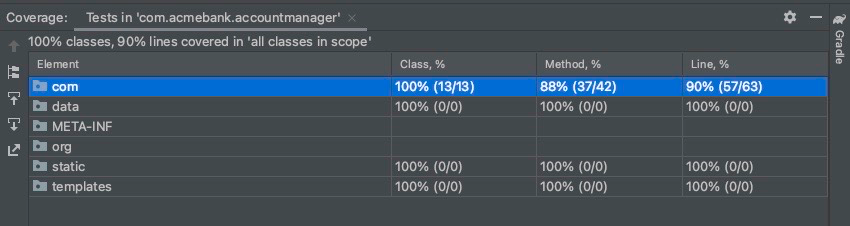
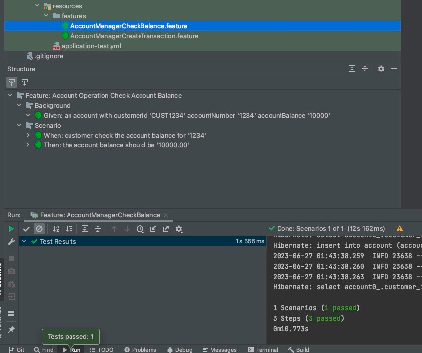

#Account Manager App

## Problem Statement

- Story 1) As a customer I would like to get the balance of my account
- Story 2) As a customer I would like to be able to transfer an amount in HKD from one account to another account

## Assumptions

- Name of the company is acmebank, and the name of the service you are implementing is account-manager (use those names for your packages)
- Those accounts already exists: 12345678, and 88888888. Each of them have an initial balance of 1,000,000 HKD
- As a customer I should be able to get balance of those accounts, and transfer money between those accounts
- All amounts are in HKD

## Technology Stack

- Programming Language - Core Java 11
- SpringBoot
- REST API
- Open API 3.0 for Swagger UI Implementation
- Test Driven Development (TDD) with JUnit 5
- Behaviour Driven Test (BDD) with Cucumber
- Database Production - H2 File based DB - for providing persistence 
- Database Test Cases - H2 In-memory DB

## How to 

- Run the Application
    1. Copy the application in a Directory
    2. Run the following command from project root
       ```./gradlew clean build bootRun```
    3. The application will run on Port 8080 (Please keep port 8080 free)
    4. The Custom Swagger UI URL is
       http://localhost:8080/ui.html

- Run the test
    1. Same as Run the Application
    2. Run following command from the project root
       ```./gradlew clean test```
    3. The Test output will come on command line 
    4. Unit Test Coverage 
    
- Run cucumber test cases
    1. I am attaching the Results of the cucumber test cases from my IDE in a document along with the project
    2. We can run by opening the project in an IDE
    3. Account balance
    
    4. Transfer Amount
    